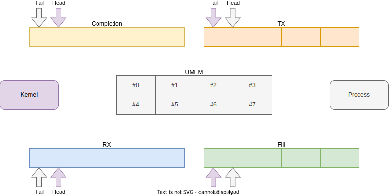
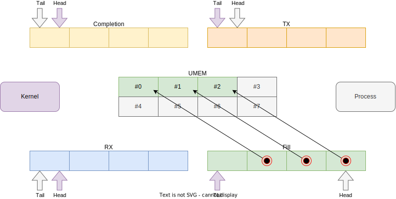
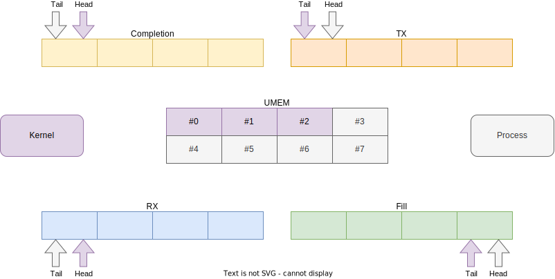
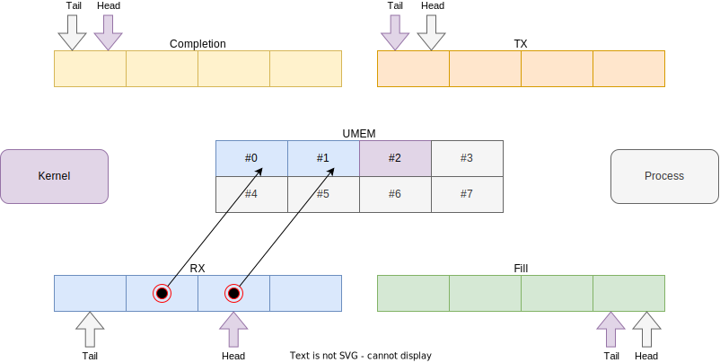
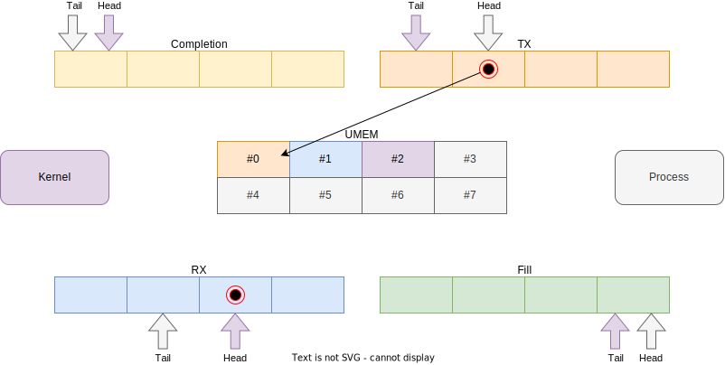
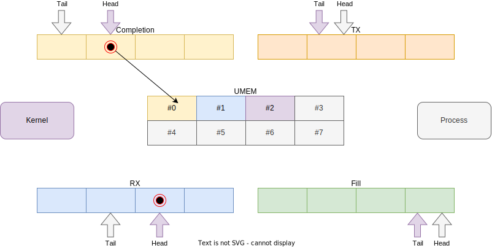
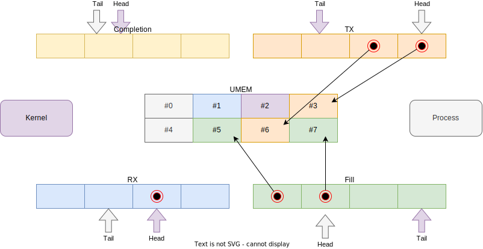

# AF_XDP

The kernel allows process to create sockets under the Address Family Express Data Path (AF_XDP) address family. This is a special socket type which in combination with an XDP program can perform full or partial kernel bypass. Bypassing the kernel network stack can increase performance in certain use cases. A socket created under the AF_XDP address family is also referred to as a XSK (XDP Socket).

Examples of such use cases are:

* Custom protocol implementations - If a kernel does not understand a custom protocol, it will do a lot of unnecessary work, bypassing the kernel and giving the traffic to a process which handles it correctly avoids overhead.
* DDoS protection - If complex processing across multiple packets is required, eBPF programs can't keep up, thus forwarding traffic to user space for analysis might be needed.
* Application specific optimization - The Linux network stack by necessity needs to handle a lot of protocols and edge cases which are not applicable to workloads you are running. This means paying performance cost for features you are not using. While not easy, one can implement a custom network stack specific to their needs, to eke out every drop of performance.

All ingress traffic is first processes by an XDP program, it can make a decision on which traffic to pass to the stack and which to bypass. This is powerful since it allows a user to bypass traffic for very specific applications, ports and/or protocols without disrupting the normal packet processing. Unlike other kernel bypass techniques such as `PACKET_MMAP` or `PF_RING` which require you to handle all traffic and re-implement every protocol needed for the host to function.

## Usage

The rest of this page goes into details on how this feature works at the kernel level. Most user will want to use a library such as [libxdp](https://github.com/xdp-project/xdp-tools/tree/master/lib/libxdp#using-af_xdp-sockets) which implements most of the difficult details. An example program can be found [here](https://github.com/xdp-project/bpf-examples/tree/master/AF_XDP-example).

!!! warning
	AF_XDP requires additional driver support on top of plain XDP support. Please check the [driver support](../program-type/BPF_PROG_TYPE_XDP.md#driver-support) table for driver compatibility.

## How it works

A XSK consists of a few "parts" which all work together and have to be setup and linked in the correct manner to get a working XSK.

{class=image-bg-white}

The socket (not displayed) ties everything together and gives the process a file descriptor which is used in syscalls. Next is the "UMEM" which is a piece of memory allocated by the process which is used for the actual packet data. It contains multiple chunks so it acts very much like an array. Lastly are 4 ring buffers: RX, TX, FILL, and COMPLETION. These ring buffers used to communicate ownership and intent for the different UMEM chunks. More details on this in the [Receiving and sending packets](#receiving-and-sending-packets) section.

### Setting up a XSK

First step is to create the socket to which we will be attaching the UMEM and ring buffers. We do so by calling the `socket` syscall as follows:

```c
fd = socket(AF_XDP, SOCK_RAW, 0);
```

Next is to setup and register the UMEM. There are 2 parameters to consider, first is the size of the chunks which determines the max packet size we can fit. This must be a value between `2048` and the page size of the system and a power of two. So for most systems the pick is between `2048` and `4096`.
The second parameter is the amount of chunks, this can be tweaked as needed, but a good default seems to be `4096`. Assuming a chunk size of `4096`, that means that we should allocate `16777216` bytes (16 MiB) of memory.

```c
static const int chunk_size = 4096;
static const int chunk_count = 4096;
static const int umem_len = chunk_size * chunk_count;
unsigned char[chunk_count][chunk_size] umem = malloc(umem_len);
```

Now that we have a UMEM, link it to the socket via the `setsockopt` syscall:

```c
struct xdp_umem_reg {
	__u64 addr; /* Start of packet data area */
	__u64 len; /* Length of packet data area */
	__u32 chunk_size;
	__u32 headroom;
	__u32 flags;
};

struct xdp_umem_reg umem_reg = {
    .addr = (__u64)(void *)umem,
    .len = umem_len,
    .chunk_size = chunk_size,
    .headroom = 0, // see Options, variations, and exceptions
    .flags = 0, // see Options, variations, and exceptions
};
if (!setsockopt(fd, SOL_XDP, XDP_UMEM_REG, &umem_reg, sizeof(xdp_umem_reg)))
    // handle error
```

Next up are our ring buffers. These are allocated by the kernel when we tell the kernel how large we want each ring buffer to be via a `setsockopt` syscall. After allocation, we can map the ring buffer into the memory of our process via the `mmap` syscall.

The following process should be repeated for each ring buffer (with different options, which will be pointed out):

We have to determine the desired ring buffer size, which must be a power of 2 for example `128`, `256`, `512`, `1024` etc. The sizes of the ring buffers can be tweaked and can differ from ring buffer to ring buffer, we will pick `512` for this example.

We inform the kernel of our chosen size via a `setsockopt` syscall:

```c
static const int ring_size = 512;
if (!setsockopt(fd, SOL_XDP, {XDP_RX_RING,XDP_TX_RING,XDP_UMEM_FILL_RING,XDP_UMEM_COMPLETION_RING}, &ring_size, sizeof(ring_size)))
    // handle error
```

After we have set the sizes for all ring buffers we can request the `mmap` offsets with a `getsockopt` syscall:

```c
struct xdp_ring_offset {
	__u64 producer;
	__u64 consumer;
	__u64 desc;
	__u64 flags;
};

struct xdp_mmap_offsets {
	struct xdp_ring_offset rx;
	struct xdp_ring_offset tx;
	struct xdp_ring_offset fr; /* Fill */
	struct xdp_ring_offset cr; /* Completion */
};

struct xdp_ring_offset offsets = {0};

if (!getsockopt(fd, SOL_XDP, XDP_MMAP_OFFSETS, &offsets, sizeof(xdp_ring_offset)))
    // handle error
```

The final step is to map the ring buffers into process memory with the `mmap` syscall:

```c
struct xdp_desc {
	__u64 addr;
	__u32 len;
	__u32 options;
};

void *{rx,tx,fill,completion}_ring_mmap = mmap(
    fd, 
    {XDP_PGOFF_RX_RING,XDP_PGOFF_TX_RING,XDP_UMEM_PGOFF_FILL_RING,XDP_UMEM_PGOFF_COMPLETION_RING},
    offsets.{rx,tx,fr,cr}.desc + ring_size * sizeof(struct xdp_desc),
    PROT_READ|PROT_WRITE,
    MAP_SHARED|MAP_POPULATE);
if (!{rx,tx,fill,completion}_ring_mmap)
    // handle error

__u32 *{rx,tx,fill,completion}_ring_consumer = {rx,tx,fill,completion}_ring_mmap + offsets.{rx,tx,fr,cr}.consumer;
__u32 *{rx,tx,fill,completion}_ring_producer = {rx,tx,fill,completion}_ring_mmap + offsets.{rx,tx,fr,cr}.producer;
struct xdp_desc[ring_size] {rx,tx,fill,completion}_ring = {rx,tx,fill,completion}_ring_mmap + offsets.{rx,tx,fr,cr}.desc;
```

We have setup our XSK and we have access to both UMEM and all 4 ring buffers. The last step is to associate our XSK with a network device and queue.

```c
struct sockaddr_xdp {
	__u16 sxdp_family;
	__u16 sxdp_flags;
	__u32 sxdp_ifindex;
	__u32 sxdp_queue_id;
	__u32 sxdp_shared_umem_fd;
};

struct sockaddr_xdp sockaddr = {
    .sxdp_family = AF_XDP,
    .sxdp_flags = 0, // see Options, variations, and exceptions
    .sxdp_ifindex = some_ifindex, // The actual ifindex is dynamically determined, picking is up to the user.
    .sxdp_queue_id = 0,
    .sxdp_shared_umem_fd = fd, // see Options, variations, and exceptions
};

if(!bind(fd, &sockaddr, sizeof(struct sockaddr_xdp)))
    // handle error
```

A XSK can only bind to a single queue on a NIC. For multi-queue NICs, the procedure of creating a XSK should be repeated for every queue. The UMEM can optionally be shared to save on memory usage, for details see the [Options, variations, and exceptions](#options-variations-and-exceptions) section.

At this point we are ready to send traffic, see [Receiving and sending packets](#receiving-and-sending-packets). But we still need to setup our XDP program and `XSKMAP` in order to bypass incoming traffic.

### eBPF program and map

To actually start bypassing ingress traffic we need an XDP program and a [`BPF_MAP_TYPE_XSKMAP`](../map-type/BPF_MAP_TYPE_XSKMAP.md) map. The map is an array type with numeric keys starting at 0 and going up. The process should populate the values of the map with the file descriptors of the XSKs obtained in the [Setting up a XSK](#setting-up-a-xsk) section. By default, the key of the map should match the queue to which the XSK is attached.

So if for example, we are dealing with a 4 queue NIC, then the map size should be at least 4, and the file descriptor of the XSK bound to queue#2 should bit assigned to key `2` in the map. If the queue-id mismatches, the packet will be dropped at runtime. (Except when using a shared UMEM, see [Options, variations, and exceptions](#options-variations-and-exceptions)).

Your XDP program can be as simple or complex as your use case requires. The actual bypassing is done with the [`bpf_redirect_map`](../helper-function/bpf_redirect_map.md) helper function.

This is an example of redirecting bypassing traffic:

```c
struct {
    __uint(type, BPF_MAP_TYPE_XSKMAP);
    __type(key, __u32);
    __type(value, __u32);
    __uint(max_entries, 64);
} xsks_map SEC(".maps");

SEC("xdp")
int xsk_redir_prog(struct xdp_md *ctx)
{
    __u32 index = ctx->rx_queue_index;

    if (bpf_map_lookup_elem(&xsks_map, &index))
        return bpf_redirect_map(&xsks_map, index, XDP_PASS);
    return XDP_PASS;
}
```

!!! note
    By default, the index given to [`bpf_redirect_map`](../helper-function/bpf_redirect_map.md) must be equal to the queue id of the NIC on which the packet was received, indicated by [`rx_queue_index`](../program-type/BPF_PROG_TYPE_XDP.md#rx_queue_index). The exception being when UMEM is shared.

The following example is a bit more complicated but demonstrates the ability to only bypass very specific traffic, in this case UDP port 9091.

```c
struct {
	__uint(type, BPF_MAP_TYPE_XSKMAP);
	__uint(max_entries, 256);
	__type(key, __u32);
	__type(value, __u32);
} xsk SEC(".maps");

SEC("xdp")
int rx(struct xdp_md *ctx)
{
	void *data, *data_meta, *data_end;
	struct ipv6hdr *ip6h = NULL;
	struct ethhdr *eth = NULL;
	struct udphdr *udp = NULL;
	struct iphdr *iph = NULL;
	struct xdp_meta *meta;
	int ret;

	data = (void *)(long)ctx->data;
	data_end = (void *)(long)ctx->data_end;
	eth = data;
	if (eth + 1 < data_end) {
		if (eth->h_proto == bpf_htons(ETH_P_IP)) {
			iph = (void *)(eth + 1);
			if (iph + 1 < data_end && iph->protocol == IPPROTO_UDP)
				udp = (void *)(iph + 1);
		}
		if (eth->h_proto == bpf_htons(ETH_P_IPV6)) {
			ip6h = (void *)(eth + 1);
			if (ip6h + 1 < data_end && ip6h->nexthdr == IPPROTO_UDP)
				udp = (void *)(ip6h + 1);
		}
		if (udp && udp + 1 > data_end)
			udp = NULL;
	}

	if (!udp)
		return XDP_PASS;

	if (udp->dest != bpf_htons(9091))
		return XDP_PASS;

	return bpf_redirect_map(&xsk, ctx->rx_queue_index, XDP_PASS);
}
```

### Receiving and sending packets

With all of the above setup work done, we can start to receive and send traffic. All code in this section takes place in the process.

Initially after creating the XSK, our state looks like this.
{class=image-bg-white}

In the above diagram you can see our UMEM section, the 4 ring buffers, the kernel and our process. The UMEM chunks are color coded to indicate "ownership".

The ring buffers are used to communicate between the process and the kernel. If done correctly, it allows for a bi-directional data stream using the same pre-allocated memory blocks without the need for spin-locks or other synchronization techniques.

The ring buffers are single-producer, single-consumer ring buffers. The rings consists of the actual array of descriptors (`#!c struct xdp_desc`), a `producer` and a `consumer`. In our diagram we refer to the `producer` as `head` and `consumer` as `tail` since those are the more typical terms used for queues/ring buffers. The kernel updates the `producer`/`head` of the RX and COMPLETION buffers and the process updated the `producer`/`head` of the TX and FILL buffers. The consumer watches for changes in the `producer`/`head`, if updated, it is safe to read the UMEM chunks between the `tail`/`consumer` and `producer`/`head`. The consumer increments the `tail`/`consumer` to indicate to the producer that the spot on the ring can be re-used. The descriptors in the ring contain a `addr` field which is the offset into the UMEM indicating the chunk, a `len` field indicating the length of any data in the chunk and a `flags` field.

When we start all chunks are owned by the process, which means it can safely read and write without fear of race conditions.

The FILL ring buffer is used to give chunks to the kernel. The kernel will fill these chunks with packet data.

The RX ring buffer is used to give chunks with ingress packet data to the process.

The TX ring buffer is used to send packets. The NIC will transmit the data inside of the indicated UMEM. The bound TX queue on the NIC is used for this.

The COMPLETION ring buffer is used by the kernel to return UMEM chunks to the process after they have been transmitted.

Armed with all of that knowledge, let's walk through a theoretical example. In this example we implement a simple UDP server, responding to incoming traffic.

We start by giving the kernel some chunks. We do this my updating the descriptions in the FILL queue and incrementing the `producer`/`head` pointer.

{class=image-bg-white}

This is important since the kernel is forced to drop packets if no chunks are available. In reality, it is therefor best to give most of your chunks to the kernel unless you have a write heavy application.

The kernel will "consume" the messages from the queue and take ownership of the UMEM chunks. It increments the `consumer`/`tail` pointer.

{class=image-bg-white}

The kernel will hold on to these chunks and write packet data into them. After a packet is fully received, the kernel will update a descriptor on the RX buffer, setting the `addr` and `len` field. Then increments the `producer`/`head` pointer.

{class=image-bg-white}

Our process needs watch the `producer`/`head` of the RX buffer to know when it can read the UMEM. The process can busy-poll or use the poll/epoll mechanisms to block/sleep until the buffer has been updated.

Once updated, our process should increment the `consumer`/`tail` pointer and do something with the packet. At this point the UMEM chunk with the data is owned by the process, so it can both read and write. 

At this point we can do a few things:

* We can keep the chunk. If your use case requires the sending of packets without responding (not strictly a request-reply protocol), it might be needed to buffer a few chunks for sending.
* We can give the chunk back via the FILL buffer. Optionally copying the contents for asynchronous processing or processing before returning the chunk.
* We can modify the chuck to turn it into a reply and transmit by adding it to the TX buffer.

Our example process makes clever use of this by modifying only some of the fields, recalculating the hashes and adjusting the sizes. It then updates a descriptor in the TX buffer and increments the `producer`/`head`.

{class=image-bg-white}

The kernel will see the pending packet, consume the TX buffer, and send out the packet on the NIC. It will then return the chunk on the COMPLETION buffer.

{class=image-bg-white}

So far we have been neatly using the top most chunks, but it should be noted that any chunk can be used at any time in any order. The process should use additional data structures to track ownership of chunks and implement algorithms to maintain a desired balance of chunks, optimized for the use case.

{class=image-bg-white}

### Options, variations, and exceptions

So far, we have been looking at a typical example which fits most situations. However, there are a few options we can change to vary the behavior.

#### (Zero) Copy mode

The process of transferring data between the NIC and UMEM can work in copy or zero-copy mode. In zero-copy mode, the NIC is given direct access to the UMEM via DMA. Since both the NIC and process work on the same memory, no memory copying occurs which is extremely good for performance. This requires driver and NIC support. For NIC and/or drivers that do not support zero-copy mode, the kernel falls back to copy mode where the driver/kernel will copy the memory back and forth between the NIC and UMEM.

You can request an explicit mode by specifying the `XDP_COPY` or `XDP_ZEROCOPY` flags when performing the bind syscall. If zero-copy mode is requested but not available, the bind syscall will result in an error.

Additionally, a bound socket can be queried with `getsockopt` and the `XDP_OPTIONS` option and `struct xdp_options` value. If the flag `XDP_OPTIONS_ZEROCOPY` is set, then the socket operates in zero-copy mode.

#### Headroom

In the setup section earlier in this article we create the XSK with a headroom of 0. Headroom is a field in `struct xdp_umem_reg`. If not zero, the kernel will shift the start of a packet within the UMEM chunk to the right. The `addr` in the ring descriptors will still indicate the start of the packet but no longer be chunk aligned.

This is desirable in situations where the user expects to encapsulate received packets and transmit them out again. The process can just write the encapsulation header in the headroom and adjust the `addr` and `len` in the descriptor of the TX ring accordingly. If headroom were not used, the process would be forced to copy the whole packet over by x bytes to facilitate the header, thus using headroom is a significant optimization.

#### TX or RX only sockets

If your use-case only requires sending or receiving it might be worthwhile to not instantiate some of the ring buffers. You can create a TX only socket by just creating the TX and COMPLETION ring buffers or a RX only socket by just creating the RX and FILL ring buffers.

#### `XDP_USE_NEED_WAKEUP`

By default, drivers will pro-actively check the TX and FILL rings to see if work needs to be done. By setting the `XDP_USE_NEED_WAKEUP` flag while binding the socket you tell the driver to never pro-actively check the ring buffers, rather the process is now responsible for triggering this via syscalls.

When `XDP_USE_NEED_WAKEUP` is set, the consuming of the FILL ring buffer must be triggered by a `recvfrom` syscall like so:

```c
recvfrom(fd, NULL, 0, MSG_DONTWAIT, NULL, NULL);
```

If the kernel runs out of chunks, to fill with packet data due to the lack of filling from the process side, the driver will disable interrupts and drop any packets until more chunks are made available.

Also, when `XDP_USE_NEED_WAKEUP` is set, the sending of packets queued in the TX buffer only happens when triggered by the `sendto` syscall like so:

```c
sendto(fd, NULL, 0, MSG_DONTWAIT, NULL, 0);
```

Operating in this mode requires more work from the process side but is recommended never the less since it can significantly improve performance, especially when operating in batches (queuing a number of packets then triggering with a single syscall).

#### XDP_UMEM_UNALIGNED_CHUNK_FLAG

In the XSK creation section we mention that the size of UMEM chunks needs to be a power of 2 between `2048` and the page size of the system. However, by specifying the `XDP_UMEM_UNALIGNED_CHUNK_FLAG` flag in `struct xdp_umem_reg->flags` the power of two restriction is lifted allowing for chunk sizes such as `3000`.

<!-- TODO does this have downsides? -->

#### XDP_SHARED_UMEM

This flag enables you to bind multiple sockets to the same UMEM. It works on the same queue id, between queue ids and between network devices. In this mode, each socket has their own RX and TX rings as usual, but you are going to have one or more FILL and COMPLETION ring pairs. You have to create one of these pairs per unique netdev and queue id tuple that you bind to.

Starting with the case where we would like to share a UMEM between sockets bound to the same netdev and queue id. The UMEM (tied to the first socket created) will only have a single FILL ring and a single COMPLETION ring as there is only on unique netdev,queue_id tuple that we have bound to. To use this mode, create the first socket and bind it in the normal way. Create a second socket and create an RX and a TX ring, or at least one of them, but no FILL or COMPLETION rings as the ones from the first socket will be used. In the bind call, set the `XDP_SHARED_UMEM` option and provide the initial socket’s file descriptor in the `sxdp_shared_umem_fd` field. You can attach an arbitrary number of extra sockets this way.

In the non-shared situation, the packet must be redirected to a socket bound to the same queue id. However, when all queues share the same UMEM, the XDP program has the freedom to pick which socket to use. This capability allows for custom RPS. A simple round-robin example of distributing packets is shown below:

```c
#include <linux/bpf.h>
#include "bpf_helpers.h"

#define MAX_SOCKS 16

struct {
    __uint(type, BPF_MAP_TYPE_XSKMAP);
    __uint(max_entries, MAX_SOCKS);
    __uint(key_size, sizeof(int));
    __uint(value_size, sizeof(int));
} xsks_map SEC(".maps");

static unsigned int rr;

SEC("xdp_sock") int xdp_sock_prog(struct xdp_md *ctx)
{
    rr = (rr + 1) & (MAX_SOCKS - 1);

    return bpf_redirect_map(&xsks_map, rr, XDP_DROP);
}
```

!!! note
    since there is only a single set of FILL and COMPLETION rings, and they are single producer, single consumer rings, you need to make sure that multiple processes or threads do not use these rings concurrently. The process needs to implement its own synchronization mechanism to manage this.

The second case is when you share a UMEM between sockets that are bound to different queue ids and/or netdevs. In this case you have to create one FILL ring and one COMPLETION ring for each unique netdev,queue_id pair. Let us say you want to create two sockets bound to two different queue ids on the same netdev. Create the first socket and bind it in the normal way. Create a second socket and create an RX and a TX ring, or at least one of them, and then one FILL and COMPLETION ring for this socket. Then in the bind call, set the `XDP_SHARED_UMEM` option and provide the initial socket’s file descriptor in the `sxdp_shared_umem_fd` field as you registered the UMEM on that socket. These two sockets will now share one and the same UMEM.

!!! note
    A UMEM can be shared between sockets on the same queue id and device, as well as between queues on the same device and between devices at the same time. However, packets can only be steered between queues on the same netdev. A packet can't be redirected to a XSK bound to a different netdev even if they share a UMEM.

