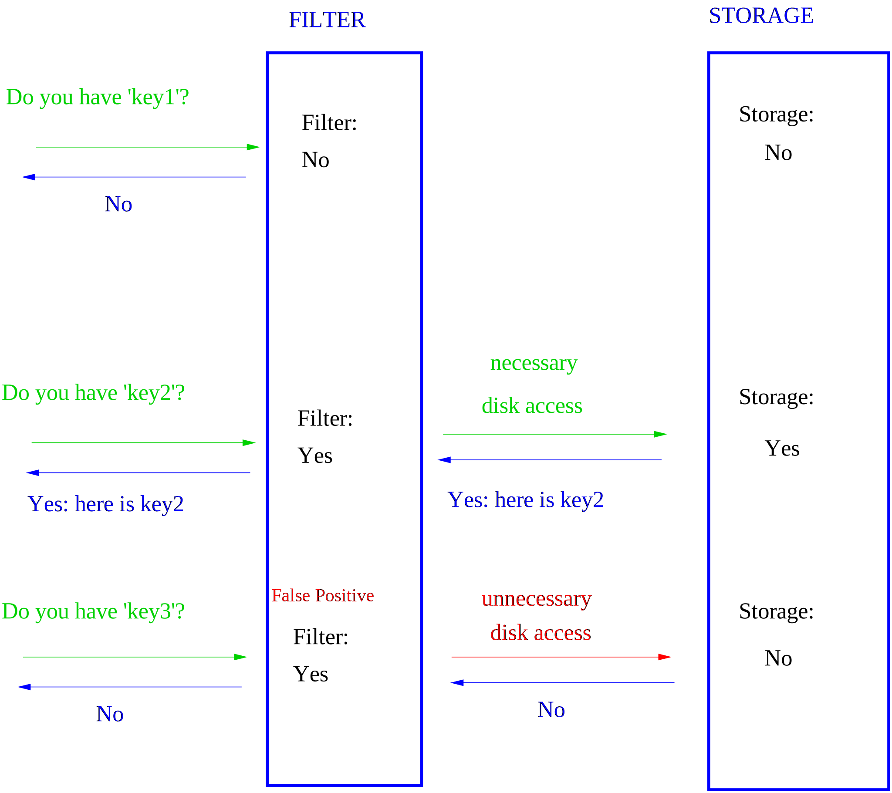
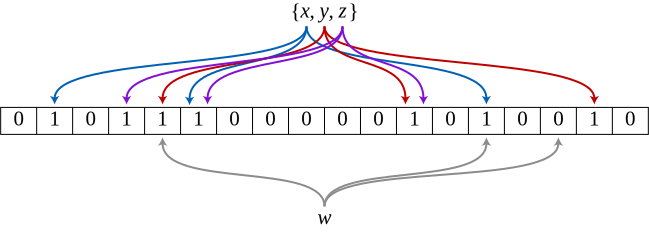

# Map type `BPF_MAP_TYPE_BLOOM_FILTER`

<!-- [FEATURE_TAG](BPF_MAP_TYPE_BLOOM_FILTER) -->
[:octicons-tag-24: v5.16](https://github.com/torvalds/linux/commit/9330986c03006ab1d33d243b7cfe598a7a3c1baa)
<!-- [/FEATURE_TAG] -->

Bloom filters are a space-efficient probabilistic data structure used to quickly test whether an element exists in a set. In a bloom filter, false positives are possible whereas false negatives are not.

## Usage

The primary use-case for bloom filters is to optimize query performance for expensive lookups into data structures. To do so you would for every lookup first query the bloom filter, if it returns `false`, then there is no need to do a more expensive lookup in the actual data structure since we know with 100% confidence that the key will not be present. If the returns is `true` however, we still need to do the lookup since the key may or may not be present.

Due to its implementation a bloom filter does not take up much memory compared to other structures and has a constant time complexity (`O(1)`).

{class=image-bg-white}

### Implementation

A bloom filter is a bitfield (array of bits). When querying the bloom filter we take our key and hash it so the result is an index into the bitfield. The result the value of the bit, 1 or 0. When writing a value we use the same hash and set the bit to 1. This deliberately causes hash collisions. So when the result of a query is 0, you know 100% that the key was never written to the bloom filter. But when the result is a 1, that may be because the key was written or due to hash collision.

In practice we use multiple hash methods for example 5, and see if all 5 indices are 1 to decrease false positives without increasing the size of the bitfield.

{class=image-bg-white}

### Limitations

Bloom filters need to be sized proportionally to the amount of keys to be inserted. The usefulness of bloom filters diminish the more saturated they become.

Keys can't be deleted from bloom filters, and thus are unsuited for scenarios where keys are frequently removed from a data structure. (bloom filters can, however, be reset and repopulated from the data structure, but this is expensive).

## Attributes

The bloom filter map does not have keys, only values. When the bloom filter map is created, it must be created with a [`key_size`](../syscall/BPF_MAP_CREATE.md#key_size) of 0.

The [`max_entries`](../syscall/BPF_MAP_CREATE.md#max_entries) size that is specified at map creation time is used to approximate a reasonable bitmap size for the bloom filter, and is not otherwise strictly enforced. If the user wishes to insert more entries into the bloom filter than [`max_entries`](../syscall/BPF_MAP_CREATE.md#max_entries), this may lead to a higher false positive rate.

The number of hashes to use for the bloom filter is configurable using the lower 4 bits of [`map_extra`](../syscall/BPF_MAP_CREATE.md#map_extra) in union bpf_attr at map creation time. If no number is specified, the default used will be 5 hash functions. In general, using more hashes decreases both the false positive rate and the speed of a lookup.

## Syscall commands

The following syscall commands work with this map type:

* [`BPF_MAP_LOOKUP_ELEM`](../syscall/BPF_MAP_LOOKUP_ELEM.md)
* [`BPF_MAP_UPDATE_ELEM`](../syscall/BPF_MAP_UPDATE_ELEM.md)

!!! note
    The `BPF_MAP_LOOKUP_ELEM` syscall command acts as `peek`, and `BPF_MAP_UPDATE_ELEM` as `push`.

## Helper functions

The bloom filter map supports two operations:

* [bpf_map_peek_elem](../helper-function/bpf_map_peek_elem.md): adding an element to the map
* [bpf_map_push_elem](../helper-function/bpf_map_push_elem.md): determining whether an element is present in the map

<!-- DO NOT EDIT MANUALLY -->
<!-- [MAP_HELPER_FUNC_REF] -->
 * [bpf_map_peek_elem](../helper-function/bpf_map_peek_elem.md)
 * [bpf_map_push_elem](../helper-function/bpf_map_push_elem.md)
<!-- [/MAP_HELPER_FUNC_REF] -->

## Flags

### `BPF_F_NUMA_NODE`

[:octicons-tag-24: v4.14](https://github.com/torvalds/linux/commit/96eabe7a40aa17e613cf3db2c742ee8b1fc764d0)

When set, the [`numa_node`](../syscall/BPF_MAP_CREATE.md#numa_node) attribute is respected during map creation.

### `BPF_F_RDONLY`

[:octicons-tag-24: v4.15](https://github.com/torvalds/linux/commit/6e71b04a82248ccf13a94b85cbc674a9fefe53f5)

Setting this flag will make it so the map can only be read via the [syscall](../syscall/index.md) interface, but not written to.

For details please check the [generic description](../syscall/BPF_MAP_CREATE.md#bpf_f_rdonly).

### `BPF_F_WRONLY`

[:octicons-tag-24: v4.15](https://github.com/torvalds/linux/commit/6e71b04a82248ccf13a94b85cbc674a9fefe53f5)

Setting this flag will make it so the map can only be written to via the [syscall](../syscall/index.md) interface, but not read from.

### `BPF_F_ZERO_SEED`

[:octicons-tag-24: v5.0](https://github.com/torvalds/linux/commit/96b3b6c9091d23289721350e32c63cc8749686be)

Setting this flag will initialize the hash table with a seed of 0.

The hashing algorithm used by the hash table is seeded with a random number by default. This seeding is meant as a mitigation against Denial of Service attacks which could exploit the predictability of hashing implementations.

This random seed makes hash map operations inherently random in access time. This flag was introduced to make performance evaluation more consistent.

!!! warning
    It is not recommended to use this flag in production due to the vulnerability to Denial of Service attacks.

!!! info
    Only users with the `CAP_SYS_ADMIN` capability can use this flag, `CAP_BPF` is not enough due to the security risk associated with the flag.

### `BPF_F_RDONLY_PROG`

[:octicons-tag-24: v5.2](https://github.com/torvalds/linux/commit/591fe9888d7809d9ee5c828020b6c6ae27c37229)

Setting this flag will make it so the map can only be read via [helper functions](../helper-function/index.md), but not written to.

For details please check the [generic description](../syscall/BPF_MAP_CREATE.md#bpf_f_rdonly_prog).

### `BPF_F_WRONLY_PROG`

[:octicons-tag-24: v5.2](https://github.com/torvalds/linux/commit/591fe9888d7809d9ee5c828020b6c6ae27c37229)

Setting this flag will make it so the map can only be written to via [helper functions](../helper-function/index.md), but not read from.

For details please check the [generic description](../syscall/BPF_MAP_CREATE.md#bpf_f_wronly_prog).
